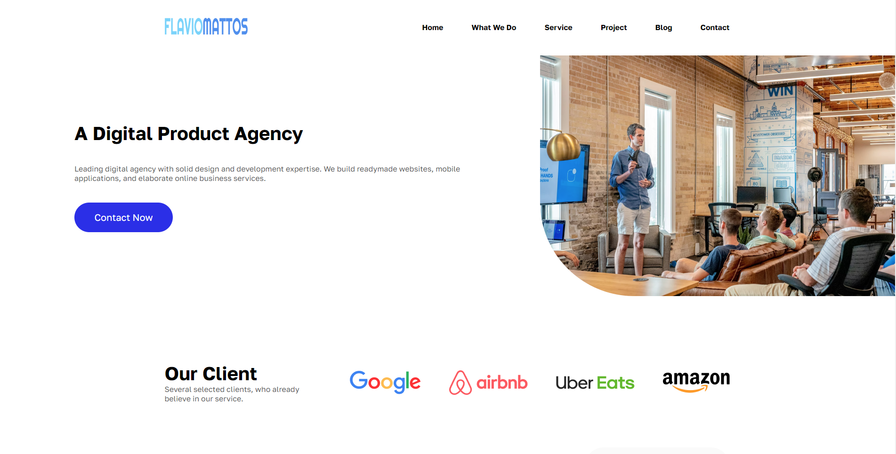

# Desafio Desenvolve 02 - Landing Page Agência

Os monitores do programa Desenvolve, do Grupo Boticário, lançaram um desafio de criar um site, que consistia em uma landing page para uma agência. Nesse projeto, tínhamos a tarefa de recriar fielmente um modelo do figma.

## 🚀 Demonstração

[Clique aqui](https://flaviomattosdev.github.io/desafio-boticario-agency/) para acessar o resultado final do projeto.

## 🛠️ Tecnologias Utilizadas

* [HTML](https://developer.mozilla.org/pt-BR/docs/Web/HTML) - Linguagem de Marcação
* [CSS](https://developer.mozilla.org/pt-BR/docs/Web/CSS) - Linguagem de Estilização
* [Javascript](https://developer.mozilla.org/pt-BR/docs/Web/JavaScript) - Linguagem de Programação

## 👨‍💻 Desenvolvedor

    
    
&nbsp&nbsp&nbspFlávio Mattos 
    &nbsp&nbsp&nbsp<a href="https://www.instagram.com/fflaviomattos/">Instagram</a>&nbsp;|&nbsp;<a href="https://github.com/FlavioMattosDev">GitHub</a>&nbsp;|&nbsp;<a href="https://www.linkedin.com/in/flavio-mattos/">LinkedIn</a>&nbsp;

  

---
